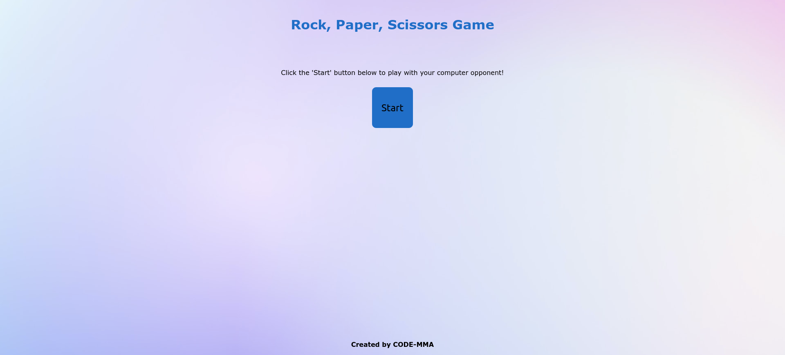

# Rock, Paper, Scissors Game

This is a solution to the [Revisiting 'Rock, Paper, Scissors' Lesson in The Odin Project](https://www.theodinproject.com/paths/foundations/courses/foundations/lessons/revisiting-rock-paper-scissors). The objective was to add a simple UI to the intial code.

## Table of contents

- [Overview](#overview)
  - [The challenge](#the-challenge)
  - [Screenshot](#screenshot)
  - [Links](#links)
- [My process](#my-process)
  - [Built with](#built-with)
  - [What I learned](#what-i-learned)
  - [Continued development](#continued-development)
  - [Useful resources](#useful-resources)
- [Author](#author)

## Overview

### The challenge

Make changes to your 'Rock, Paper, Scissors' project by adding simple user interfaces and utilizing Git branching.

### Screenshot

### Links

- Live Site URL: [Github Page](https://code-mma.github.io/rps/)

## My process

### Built with

- Semantic HTML5 markup
- CSS custom properties
- Vanilla JavaScript
- jQuery UI

### What I learned

From these exercises, I applied my knowledge in JavaScript and DOM manipulations. At the same time, I managed to use jQuery UI for animating elements.

### Continued development

Future modification includes furnishing visuals.

### Useful resources

- [The Odin Project](https://www.theodinproject.com) - The site that guided me to become better at frontend development.
- [Gradienta from Pexels](https://www.pexels.com/@gradienta) - Thanks to the author of the background picture

## Author

- GitHub Profile - [Michael Angelo](https://github.com/code-mma)

